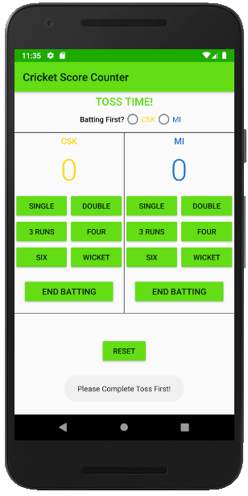
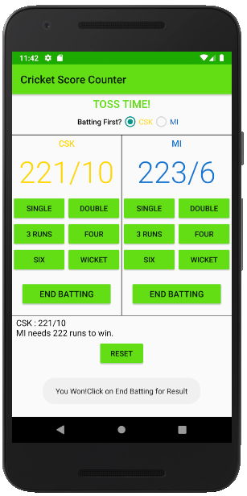

# Cricket Score Keeper App
## Description  
A score keeper app for the game of **Cricket**.It includes following funtionalities :  
<dl>
  <li>Gives option for **Toss** and select the team to bat first.</li>
  <li>Other team's score can't be altered, so only **one team can bat at one time**.</li>
  <li>Batting can be **submitted** at any time.</li>
  <li>**Innings score** as well as **result** of match is displayed after match is finished.</li>
  <li>Everything can be **reset** at one click at any time.</li>
</dl>  

## Screenshots  

